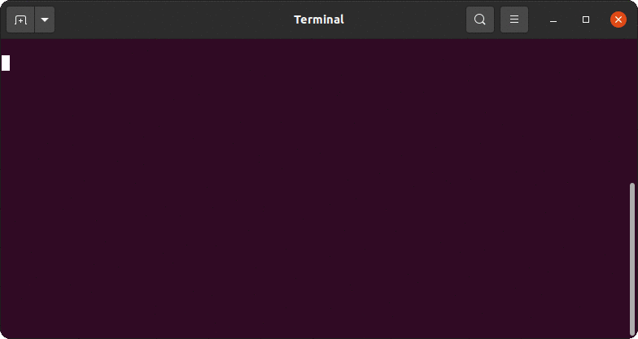
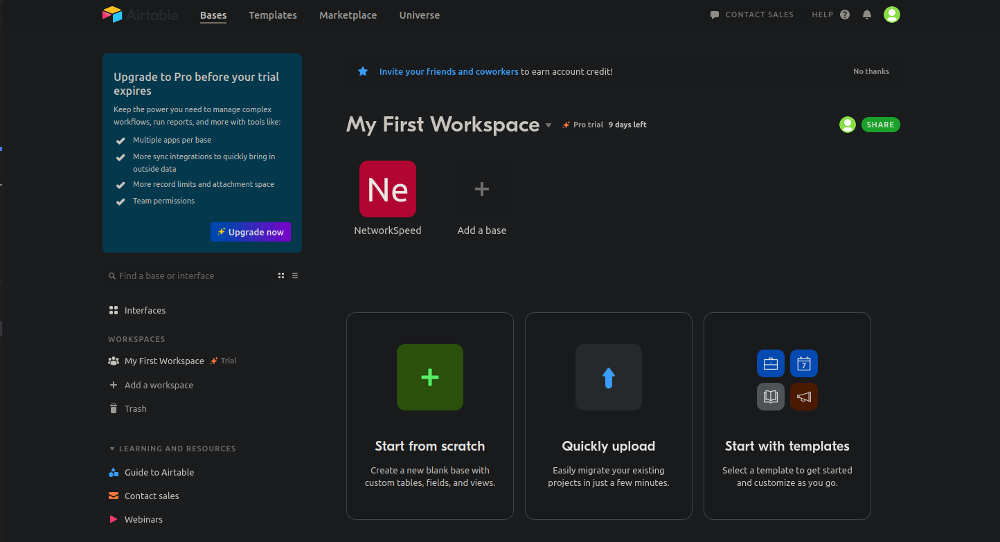
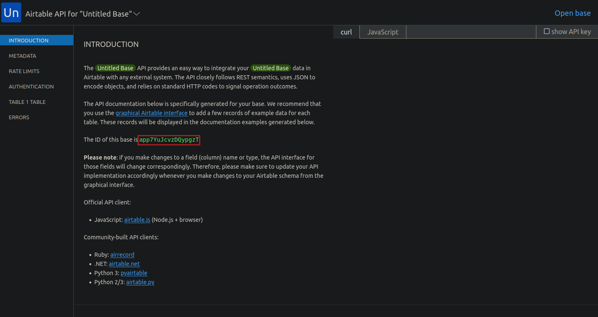
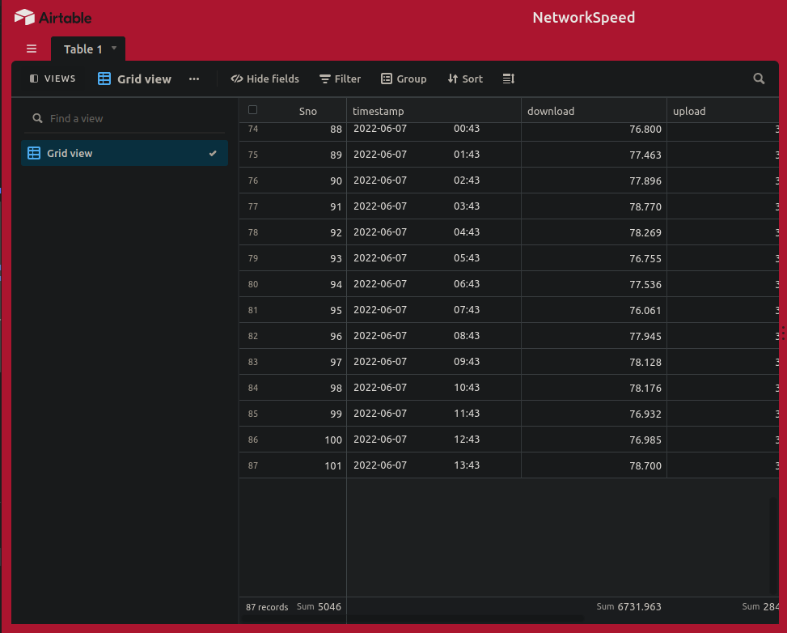
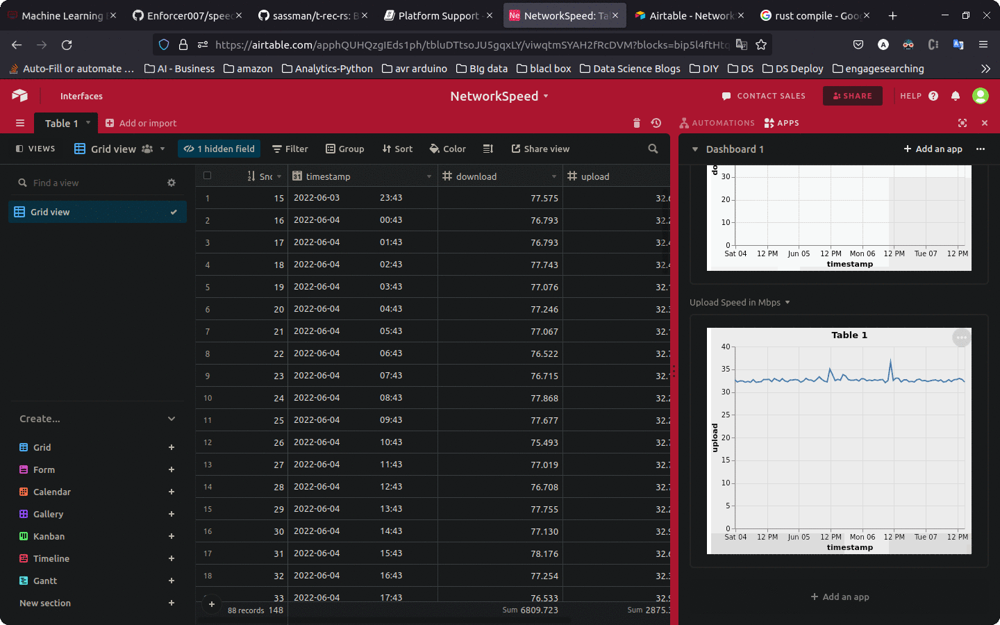

+++
title = "Checking performance of Home Internet 🚀"
description = "Speed test's internet connection and displays the results in a graph daily using Airtable."
date = 2022-06-06

[taxonomies]
categories = ["Technology"]
tags = ["speedtest","raspberrypi"]
[extra]
metadata_image = "thumbnail.png"
+++

Speed Test


I have recently subscribed to a new ISP(Internet Service Provider) for upgrading my Internet Speed Download and Upload Speeds to 150Mbps. 
During the first week the speed was good but slowly the service from the ISP started deteriorating. The speeds were varying drastically and currently it's hovering around <ins>77Mbps</ins> for downloads and <ins>30Mbps</ins> for Uploads.

The ISP would increase the speeds, whenever I complain them. But after some time again they decrease. Recently, I've started going to [www.speedtest.net](https://www.speedtest.net/) website regularly to keep a tab on the speeds. But it's very painful to repeatedly open the site and test the internet speeds. Therefore I've created an **Internet Speed Test App** hosted it on Raspberrypi that runs every Hour. The results are recorded into Airtable and visualized in a graph.


## How to build it ?

I built the App using Rustlang 🦀. I've cross-compiled the application to Raspberrypi model 1 executable using [raspi_tools](https://github.com/raspberrypi/tools).

I've tried to build the App from scratch but the results weren't true to the speedtest.net results. I stopped working on it as my objective was to get an app that can push speedtest results to Airtable. Using speedtest-cli from Ookla I was able to fork the speedtest app from Rust and obtain the results. Here's how I made it.

As I'm running on ubuntu I've installed the speedtest-cli from this [link](https://www.speedtest.net/apps/cli). After Installing test it by running `speedtest` command from terminal. 

### Create Airtable Account
Create an [Airtable Account](https://airtable.com/signup#) and [create a base](https://airtable.com/). 

Goto [Account Overview](https://airtable.com/account) and get the API KEY to insert speedtest records into Airtable. Also fetch the base ID of the table
from rest API docs 

### TestRun speedtest in local machine
Git clone the [speedtest repo](https://github.com/Enforcer007/rustyspeedtest) and run below command to check if speedtest and insertion works properly

> Please refer to [https://rustup.rs/](https://rustup.rs/) for installing Rustlang along with Cargo.

```bash
env AIRTABLE_BASE_ID=xxxxx AIRTABLE_AUTH_KEY=xxxxxxxx cargo run
```

Speedtest will be run followed by insertion of results into the Airtable. Verify the results in the table. 

### Raspberrypi Setup
After everything goes well! #emoji. It's time to build the app for Raspberrypi.

Connect to Raspberrypi from terminal and install, extract the [speedtest-cli](https://install.speedtest.net/app/cli/ookla-speedtest-1.1.1-linux-armhf.tgz) application

```bash
curl https://install.speedtest.net/app/cli/ookla-speedtest-1.1.1-linux-armhf.tgz -o speedtest.tgz

tar zxvf ookla-speedtest.tgz -C ./ookla
```

Run the speedtest command to test if it's running in Raspberrypi
```bash
ookla/speedtest
```

### Cross Compiling from local machine to build an executable for Raspberrypi
After the test run, let's cross compile `speedtest` to raspberrypi to be compatible. Let's setup few dependencies for cross compilation in Ubuntu.

git clone [raspi_tools](https://github.com/raspberrypi/tools.git) and set the path of linker present in the folder at `~/.cargo/config` as
```bash
[target.arm-unknown-linux-gnueabihf]
linker = "<parent-path>/tools/arm-bcm2708/arm-rpi-4.9.3-linux-gnueabihf/bin/arm-linux-gnueabihf-gcc"
```
Also rust should know the target architecture of the raspberrypi. Let's add by running below command.

```bash
rustup add arm-unknown-linux-gnueabihf
```

Add Raspberrypi's ip-address in `deploy.sh`.
```bash

readonly TARGET_HOST=<user>@<ip-address>

```

### Installing in Raspberrypi and setting up Cron Job
Run the `deploy.sh` file after the changing the Ip-Address. It runs the `cargo build` command and generates the executable suitable to run on raspberrypi. After which it pushes the executable to Raspberrypi using rsync.

Validate that the executable is present in raspberrypi at the path `/home/pi/speedtest`. Run the executable as below to verify the records are inserted into Airtable.

```bash
env AIRTABLE_BASE_ID=xxxxx AIRTABLE_AUTH_KEY=xxxxxxxx /home/pi/speedtest
```

If everything works good, speedtest records are inserted into Airtable and now we can setup a Cron Job.

To setup cron job for every <ins>one hr at 43rd minute</ins> open the crontab file by running `crontab -e` and write below lines.

```bash
AIRTABLE_BASE_ID=xxxxxxx
AIRTABLE_AUTH_KEY=xxxxxxxxx
PATH=/home/pi/ookla:$PATH
43 */1 * * * /home/pi/speedtest >> /home/pi/speedtest.log

```
### Visualizing the Dashboard in Airtable
It's Done! The speedtest is run every one hr on raspberrypi and results are recorded in the Airtable. It's dull and boring to see all the records in a table. Let's visualize it in a graph.

Goto App Sections in the Airtable and click on Add an App. From there search for **Vega-Lite** app to add it.


Select the table from the drop down after adding and paste the below json to visulaize the download data.
```json
{
  "$schema": "https://vega.github.io/schema/vega-lite/v4.json",
  "title": "Table 1",
  "width": "container",
  "height": "container",
  "mark": "line",
  "encoding": {
    "x": {
      "field": "timestamp",
      "type": "temporal"
    },
    "y": {
      "field": "download",
      "type": "quantitative"
    }
  }
}
```

Repeat the same step i.e, adding an app for visualizing the upload speed column and change the y-field to upload.

Yipee Here we have the Dashboard visualizing the Results.

**Currently my home network's Internet Speed Graph's can be seen here:**

<iframe class="airtable-embed" src="https://airtable.com/embed/shr6keYVxjy6V0maD?backgroundColor=red" frameborder="0" onmousewheel="" width="100%" height="533" style="background: transparent; border: 1px solid #ccc;"></iframe>


## 📫 How to reach me
I'm always active on Twitter. You can follow me at [](https://mobile.twitter.com/143akhi)