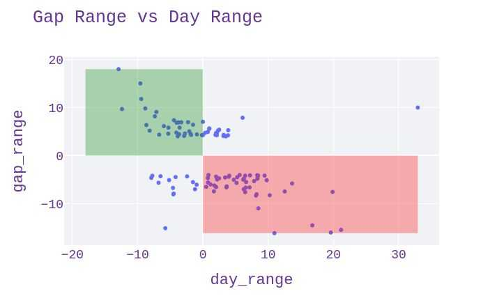
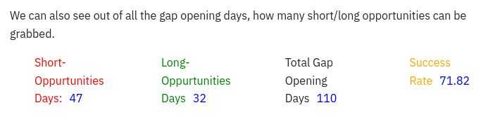

+++
title = "Gap Up Gap Down Trading"
description = "Intra-Day Trading during gap up/down days"
date = 2021-09-03

[taxonomies]
categories = ["Trading"]
tags = ["stock","trading","algo trading"]
[extra]
metadata_image = "thumbnail.jpg"
+++

Install fonts quickly on linux


We will try to analyse what should be our directional view for intra-day trades when market gaps up/down.

Generally, when the market gap's up we expect to see there's a bullish view on stock and similarly for gap down a bearish view.

Keeping that in mind let's pick PNB stock for this analysis and lets try to see how the share price performed in a day during gap up/gap down days.

This graph tells movement of shares price in a given day when there's a gap up/down of more than 4%.

We can observe that most of the days are concentrated in two areas covered in rectangles.

Surprisingly, we can see there's inverse relation. If there's a gap up we can see day ended in loss that appears in the Green rectangle. Similarly if there's a gap down we can observe day ended high as observed in Red rectangle.

To make more sense consider the day when there was the highest gap-up i.e on 2002-07-15 @18% if we observe the day went down by -12.92% 😲. If a trader with bullish view takes a long call then he would have definitely hit loss 😭.

Therefore it is suggested to, preferably take reverse calls whenever there's a gap up/down i.e, taking short and long calls respectively. ❗(Not an advisory)

We can also see out of all the gap opening days, how many short/long opportunities can be grabbed.

For doubts, questions or want to know Elon Musk's next tweet on bitcoin, reachme out on twitter: @143akhi

Click below on streamlit for an interactive tour of the above strategy.

<a href="https://share.streamlit.io/enforcer007/streamlit/main/app.py"></img></a>

